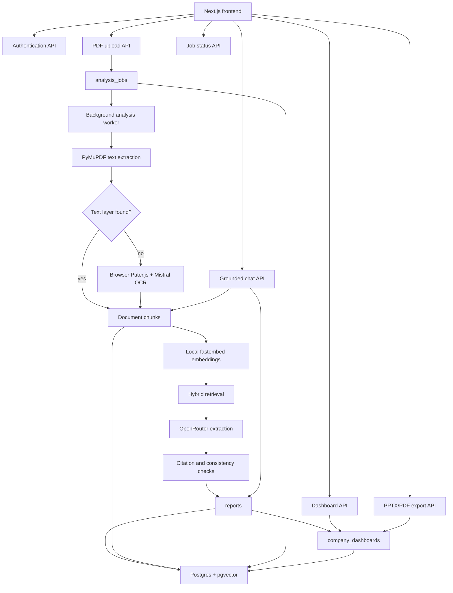

# FinAI Analyzer

FinAI Analyzer is a full-stack financial intelligence platform for turning financial statement PDFs into verified, source-backed analysis. Users upload annual reports, filings, statements or other financial PDFs, and the system extracts key financial data, validates the evidence, builds an interactive dashboard, supports grounded financial Q&A, and exports board-ready PPTX or PDF reports.

The product is designed for finance, diligence, research and reporting workflows where every number needs to be traceable. Instead of presenting model output as-is, FinAI Analyzer keeps page-level provenance, verifies citations against source text, detects conflicting values across reports, and marks fields that need review or are not available in the uploaded documents.

## What FinAI Analyzer Does

FinAI Analyzer helps users move from raw financial PDFs to a structured analysis workspace:

- Upload one or more company financial reports.
- Extract core financial metrics, ratios, statements, segment performance, geographic performance, risks, outlook, notes and disclosures.
- Verify extracted values against the original PDF pages.
- Build a unified company dashboard across uploaded reports.
- Show documents analysed, missing data, conflicts and source references.
- Ask report-specific or company-level questions through a grounded chatbot.
- Export the dashboard as PPTX or PDF with server-side validation before download.

## Core Capabilities

### Source-Backed Financial Extraction

The analysis worker extracts structured financial information from uploaded PDFs using a document-aware retrieval and extraction pipeline. It handles annual reports, interim statements, earnings releases, investor presentations and shorter financial updates.

Extracted data includes:

- Company and reporting period details
- Revenue, EBITDA, net income and other income statement figures
- Assets, liabilities, equity, cash and debt
- Cash flow metrics
- Segment and geographic performance
- Financial health ratings
- Risk factors, outlook and management commentary
- Auditor and accounting matters
- Notes and disclosures

### Citation Verification and Provenance

Every accepted fact must be supported by a verified citation. Numeric values are checked against source text, and textual claims require source evidence. The dashboard exposes citations and provenance so users can trace a value back to the document and page that supports it.

FinAI Analyzer uses public UUIDs in URLs and API responses. Internal numeric database IDs remain inside the backend.

### Unified Company Dashboard

Each company has one current dashboard built from validated reports. The dashboard includes:

- Financial summary
- Documents analysed
- Key metrics
- Trend charts
- Deterministic ratios
- Segment and geographic analysis
- Notes and disclosures
- Missing-data messages
- Source conflicts
- Source hierarchy and external-source status

The dashboard is the primary analysis surface. PPTX and PDF exports are generated from the same presentation model so exported files remain aligned with the dashboard content.

### Grounded Chatbot

The chatbot answers questions using the verified dashboard data and retrieved document excerpts. It checks numeric claims against the verified dataset before returning an answer, reducing unsupported or inconsistent responses.

Users can ask questions such as:

- "What drove revenue growth?"
- "How did operating cash flow change?"
- "Which risks are most important?"
- "Compare the latest report with the previous period."
- "Where did this EBITDA value come from?"

### OCR for Scanned PDFs

The backend first attempts native text extraction with PyMuPDF. If a PDF has no usable text layer, the job moves into an OCR-required state. The frontend then runs browser-side Puter.js with Mistral OCR and sends page-level OCR text back to the backend so the same analysis pipeline can resume.

No backend Mistral API key is required.

### Validated PPTX and PDF Export

FinAI Analyzer generates presentation exports for both company dashboards and individual reports. Exports include substantive dashboard content, not just an executive summary.

The export path validates:

- PPTX package structure
- Slide count
- Readable slide content
- Dashboard-to-presentation coverage
- PDF page count
- Readable PDF text
- Raw JSON or internal identifier leakage

PDF generation uses LibreOffice conversion when available and a PyMuPDF fallback renderer when needed.

## System Architecture



## Processing Flow

```text
User uploads PDF
  -> backend validates file type and size
  -> report and analysis job are created
  -> frontend receives report UUID and job UUID

Background worker
  -> atomically claims queued job
  -> extracts native text with PyMuPDF
  -> requests browser OCR only when needed
  -> chunks and embeds page text
  -> retrieves relevant financial sections
  -> enriches selected pages with table rows
  -> extracts structured financial data
  -> verifies citations and values
  -> checks completeness and consistency
  -> saves the report
  -> publishes or refreshes the company dashboard
```

## Technology Stack

| Layer | Technology |
| --- | --- |
| Frontend | Next.js 16, React 19, Tailwind CSS |
| Backend | Flask, Gunicorn |
| Database | Postgres with pgvector |
| Embeddings | fastembed with BAAI/bge-small-en-v1.5 |
| PDF text extraction | PyMuPDF |
| Browser OCR | Puter.js with Mistral OCR |
| LLM access | OpenRouter-compatible API |
| Exports | python-pptx, LibreOffice, PyMuPDF |
| Deployment | Docker, Render-ready backend config, standalone Next frontend build |

## Production Deployment

FinAI Analyzer can run on any production environment that supports a Dockerized Flask backend, a Next.js frontend and Postgres with the `vector` extension.

Recommended production setup:

- Host the backend as a Docker web service.
- Host the frontend as a Next.js app or Docker service.
- Use managed Postgres with pgvector enabled.
- Serve frontend and backend over HTTPS.
- Set explicit CORS origins for the deployed frontend domain.
- Use a strong `AUTH_SECRET`.
- Store API keys and secrets in the hosting provider's environment manager.
- Keep uploaded PDF bytes only for active jobs; the application clears job file bytes after processing.

### Backend Environment Variables

| Variable | Required | Purpose |
| --- | --- | --- |
| `DATABASE_URL` | Yes | Postgres connection string with pgvector support |
| `LLM_API_KEY` | Yes | API key for the OpenRouter-compatible LLM provider |
| `AUTH_SECRET` | Yes | Secret used to sign session JWTs |
| `CORS_ORIGINS` | Yes | Comma-separated list of allowed frontend origins |
| `FRONTEND_ORIGIN` | Optional | Additional frontend origin appended to CORS settings |
| `LLM_BASE_URL` | Optional | Defaults to `https://openrouter.ai/api/v1` |
| `LLM_PRIMARY_MODEL` | Optional | Primary model for extraction and complex chat |
| `LLM_REASONING_MODEL` | Optional | Fallback reasoning model |
| `LLM_FAST_MODEL` | Optional | Fast model for lighter extraction tasks |
| `FLASK_ENV` | Optional | Use `production` in deployed environments |
| `LOG_LEVEL` | Optional | Defaults to `INFO` |
| `MAX_UPLOAD_MB` | Optional | Maximum PDF upload size, default `20` |
| `JWT_EXPIRY_DAYS` | Optional | Session lifetime, default `7` |
| `JOB_POLL_INTERVAL_SECONDS` | Optional | Worker polling interval |
| `JOB_STALE_AFTER_SECONDS` | Optional | Time before stale processing jobs are reclaimed |
| `JOB_MAX_RETRIES` | Optional | Maximum worker retries for failed jobs |
| `JOB_OCR_TIMEOUT_SECONDS` | Optional | Time before abandoned OCR jobs fail |
| `MAX_QUERY_LENGTH` | Optional | Maximum chatbot question length |

Production cookies are marked secure when `FLASK_ENV=production`. Use HTTPS in production so authentication works correctly.

### Frontend Environment Variables

| Variable | Required | Purpose |
| --- | --- | --- |
| `NEXT_PUBLIC_API_URL` | Yes | Public backend URL used by the browser |

Example:

```bash
NEXT_PUBLIC_API_URL=https://api.example.com
```

### Render Backend Deployment

The repository includes `render.yaml` for deploying the backend as a Render Docker service. Configure the required secrets in Render:

- `DATABASE_URL`
- `LLM_API_KEY`
- `CORS_ORIGINS`
- `AUTH_SECRET`

`AUTH_SECRET` can be generated by the platform or with:

```bash
python3 -c "import secrets; print(secrets.token_hex(32))"
```

### Docker Deployment

The backend Dockerfile runs Gunicorn on port `5000`. The frontend Dockerfile builds a standalone Next.js server and runs it on port `3000`.

For a single-host deployment with Docker Compose:

```bash
docker compose up --build
```

For managed production hosting, deploy the services separately and point the frontend `NEXT_PUBLIC_API_URL` to the public backend URL.

## Local Development

### Prerequisites

- Python 3.11+
- Node.js 20+
- Docker
- OpenRouter-compatible API key

### Start Postgres

```bash
docker compose up -d postgres
```

The schema in `backend/db/schema.sql` is applied automatically to the local database container. The backend also applies the schema idempotently on startup.

### Start Backend

```bash
cd backend
python3 -m venv .venv
source .venv/bin/activate
pip install -r requirements.txt
cp .env.example .env
python3 -c "import secrets; print(secrets.token_hex(32))"
python app.py
```

Fill `LLM_API_KEY` and `AUTH_SECRET` in `backend/.env` before running the application normally.

Backend URL:

```text
http://localhost:5000
```

Health check:

```text
http://localhost:5000/health
```

### Start Frontend

```bash
cd frontend
npm install
cp .env.local.example .env.local
npm run dev
```

Frontend URL:

```text
http://localhost:3000
```

Use the same hostname family for frontend and backend in local development, normally `localhost`, so browser cookies are sent correctly.

## API Overview

All routes except `/health`, `/api/auth/signup` and `/api/auth/login` require a signed session cookie.

| Route | Method | Purpose |
| --- | --- | --- |
| `/health` | GET | Backend health and dependency check |
| `/api/auth/signup` | POST | Create account and set session cookie |
| `/api/auth/login` | POST | Sign in and set session cookie |
| `/api/auth/logout` | POST | Clear session cookie |
| `/api/auth/me` | GET | Return current user |
| `/upload/` | POST | Validate and queue PDF analysis |
| `/jobs/{job_id}/status` | GET | Poll analysis job status |
| `/jobs/by-report/{report_id}/status` | GET | Poll latest job for a report UUID |
| `/jobs/{job_id}/ocr-document` | GET | Fetch PDF bytes for browser OCR |
| `/jobs/{job_id}/ocr-result` | POST | Submit browser OCR result |
| `/fetch_data/{id}` | GET | Fetch one user-owned report |
| `/fetch_data/{id}` | DELETE | Delete one user-owned report |
| `/fetch_all_data/?limit=&offset=` | GET | Paginated user report list |
| `/api/reports/{id}/diagnostics` | GET | Completeness and consistency diagnostics |
| `/api/dashboard` | GET | User company dashboard list |
| `/api/companies/{id}/dashboard` | GET | Unified company dashboard |
| `/api/reports/{id}/dashboard` | GET | Dashboard for one report |
| `/api/companies/{id}/presentation?format=pptx\|pdf` | GET | Company export |
| `/api/reports/{id}/presentation?format=pptx\|pdf` | GET | Report export |
| `/query/` | POST | Grounded chatbot query |

## Security and Data Handling

FinAI Analyzer uses cookie-based authentication with signed JWT sessions. Route handlers resolve public UUIDs to user-owned internal records before reading or mutating data. This keeps reports, jobs, dashboards and exports isolated by user.

Security and data-handling features include:

- httpOnly session cookies
- secure cookies in production
- user-scoped report, job and company queries
- public UUIDs for URL-facing identifiers
- upload size limits
- PDF-only upload validation
- no backend OCR API key requirement
- no raw provider errors or secrets returned to users
- no raw JSON or internal identifiers in validated exports

## Operational Validation

Run these checks before deploying changes:

```bash
cd frontend
npm run lint
npm run build
```

```bash
python3 -m compileall -q backend
```

Recommended live checks:

- Start the backend and verify `/health`.
- Start the frontend and sign up or log in.
- Upload a normal financial PDF.
- Upload a scanned PDF and confirm browser OCR resumes the job.
- Open the report dashboard.
- Open the company dashboard.
- Ask a grounded chatbot question.
- Expand source details and verify page references are present.
- Export PPTX and PDF.
- Confirm exported files open successfully.

## Known Operational Notes

- Extraction quality depends on PDF formatting and source document quality.
- Reports in different currencies are not automatically converted.
- Scanned PDF OCR requires a browser session where Puter.js is available.
- Chat history is held in frontend state for the current page session.
- The background worker runs inside the backend process, so production scaling should avoid competing workers unless the database-backed job locking behavior is understood.
